# SnapMath
# Выбор датасета

Для нашего проекта по распознаванию математических символов мы провели исследование доступных датасетов на платформе Kaggle и выбрали один из наиболее подходящих и полноценных.  
Этот датасет включает более 100 000 образцов рукописных изображений математических символов, что позволяет создавать модели, способные эффективно работать с реальными данными.

Особенностью выбранного набора данных является его разнообразие и широкий спектр включённых символов. Он включает в себя:
- Основные математические операторы и функции, такие как интеграл (∫), сумма (∑), квадратный корень (√), предел (lim).
- Греческие буквы (альфа, бета, гамма, мю, сигма, фи, тета), которые часто используются в математической и научной литературе.
- Английские буквенно-цифровые символы, что расширяет возможности для создания универсальных моделей распознавания.

### Преимущества выбранного датасета:
- Актуальность: несмотря на то что обновлялся последний раз несколько лет назад, датасет остаётся подходящим для задачи классификации математических символов.
- Разнообразие: широкий охват символов, включая как базовые, так и специализированные математические обозначения.
- Количество данных: более 100 000 образцов, что обеспечивает надёжное обучение моделей.
- Удобный размер изображений: размер 45x45 пикселей позволяет легко обрабатывать данные.

# Источники по датасету:
1. [Classifying Handwritten Math Symbols on Kaggle](https://www.kaggle.com/code/kalikichandu/classifying-handwritten-math-symbols-fastai/input)

---

# Разбиение текста на буквы

Первым шагом разобьем текст на отдельные буквы. Для этого пригодится OpenCV, точнее его функция findContours.

Откроем изображение (cv2.imread), переведем его в ч/б (cv2.cvtColor + cv2.threshold), слегка увеличим (cv2.erode) и найдем контуры.

Буквы готовы для распознавания, распознавать их мы будем с помощью сверточной сети — этот тип сетей неплохо подходит для таких задач.

Нейронная сеть (CNN) u-net? для распознавания

Обучаем на том датасете что нашли находиить символы матиматики, и отдельно распозновать буквы русского языка

---

# Источники по разбиению

1. [Python + OpenCV + Keras: делаем распознавалку текста за полчаса](https://habr.com/ru/articles/466565/)


# Метрики. Методы оценки моделей классификации.

# Метод F1

F1 полезен в условиях, когда распределение результатов неравномерно или когда стоимость ложноположительных и ложноотрицательных результатов значительна.  
F1 — это среднее гармоническое между точностью (Precision) и полнотой (Recall):

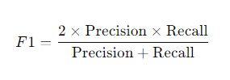

### Precision (Точность)

Precision — это доля правильных положительных предсказаний среди всех предсказанных положительных:

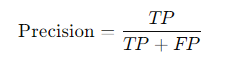

Где:
- **TP** — количество истинно положительных предсказаний (True Positives).
- **FP** — количество ложноположительных предсказаний (False Positives).

### Recall (Полнота)

Recall — это доля правильных положительных предсказаний среди всех реальных положительных:

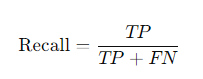

Где:
- **FN** — количество ложных отрицательных предсказаний (False Negatives).

### Неравномерное распределение результатов

Когда мы говорим, что распределение результатов неравномерное, мы имеем в виду ситуацию, когда классы в данных сильно не сбалансированы.  
Например, в задаче классификации email'ов на «спам» и «не спам» большинство писем могут быть «не спамом», а совсем немного — «спамом».

Если использовать просто точность (Accuracy), то модель, которая всегда предсказывает "не спам", будет иметь высокую точность, так как подавляющее большинство писем действительно не спам. Однако такая модель будет не полезной, так как она не сможет правильно классифицировать спам.

В таких случаях F1-метрика дает более информативную оценку, потому что она балансирует точность и полноту, предотвращая смещение в сторону самого распространенного класса и учитывая ошибки в обоих направлениях:
- **Ложноположительные (FP):** когда модель предсказывает положительный класс, но на самом деле это отрицательный класс.  
  Например, когда система определяет нормальное письмо как спам.
- **Ложноотрицательные (FN):** когда модель предсказывает отрицательный класс, но на самом деле это положительный.  
  Например, когда спам-сообщение не было распознано и попало в папку с обычной почтой.

### F-бета мера

В случае, если нужно больше уделить внимание **Precision** или **Recall**, можно использовать F-бета меру такого вида:

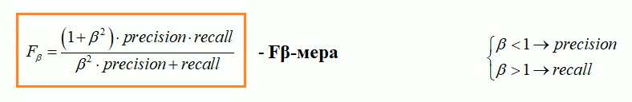

- При **β < 1** большее внимание уделяется **Precision**.
- При **β > 1** большее внимание уделяется **Recall**.

---

# Метод Accuracy

**Accuracy** считает общее количество правильных ответов среди всей выборки, что плохо при неравномерных данных.  
Например, если в нашем датасете всего 600 наблюдений, из которых 550 — положительные, а 50 — отрицательные, и наша модель верно определила 530 положительных и всего 5 отрицательных, то общая Accuracy равна:
(530 + 5) / 600 = 0.8917


Это означает, что точность модели составляет **89.17%**.  
Полагаясь на это значение, можно подумать, что для любой выборки (независимо от ее класса) модель сделает правильный прогноз в 89.17% случаев. Однако это неверно, так как для класса **Negative** модель работает очень плохо.

---

# Метод Precision

**Precision** представляет собой отношение числа семплов, верно классифицированных как **Positive**, к общему числу выборок с меткой **Positive** (распознанных правильно и неправильно).  
Precision измеряет точность модели при определении класса **Positive**.

**Precision** фактически показывает процент доверия, что наблюдение относится к классу **Positive**. То есть сколько позитивных наблюдений действительно были определены как позитивные.  
Другими словами, Precision помогает оценить, оправдывается ли подавляющее большинство рекомендаций модели.

### Проблемы Precision:
- НЕ показывает охват позитивных наблюдений.  
  Например, Precision может выдать высокий результат для модели, которая называет положительными только заведомо очевидные наблюдения (например, "очевидно, что Илон Маск выплатит кредит за тостер").

---

# Метод Recall

**Recall** рассчитывается как отношение числа Positive выборок, корректно классифицированных как **Positive**, к общему количеству Positive семплов.  
Recall измеряет способность модели обнаруживать выборки, относящиеся к классу **Positive**. Чем выше Recall, тем больше Positive семплов было найдено.

**Recall** заботится только о том, как классифицируются Positive выборки. Эта метрика не зависит от того, как предсказываются Negative семплы, в отличие от Precision.  
Когда модель корректно классифицирует все Positive выборки, Recall будет **100%**, даже если все представители класса Negative были ошибочно определены как Positive.

### Пример:

На следующем изображении представлены 4 разных случая (от A до D), и все они имеют одинаковый Recall, равный **0.667**.  
Представленные примеры отличаются только тем, как классифицируются Negative семплы. Например, в случае **A** все Negative выборки корректно определены, а в случае **D** — наоборот.  
Независимо от того, как модель предсказывает класс Negative, Recall касается только семплов, относящихся к Positive.

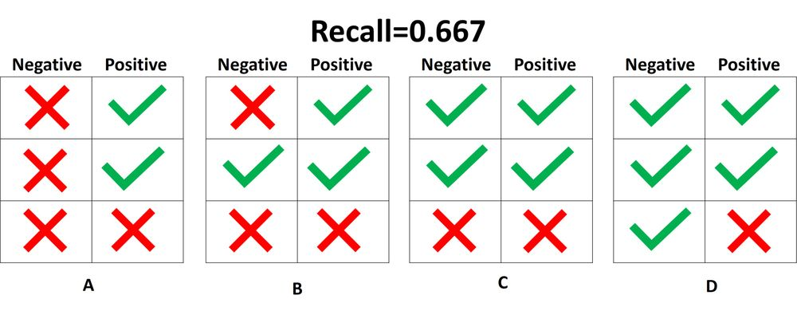

---

# Precision или Recall?

Если мы хотим понять точность предсказания **Positive** и учесть в этой оценке те **Negative** наблюдения, которые модель пометила как Positive – нам нужно использовать **Precision**.

Если нам важно только, насколько хорошо модель предсказывает **Positive** наблюдения, и нам совсем не важно, сколько было ошибок в **Negative** наблюдениях – мы используем **Recall**.

#### ХОРОШАЯ МОДЕЛЬ ДОЛЖНА ПОКАЗЫВАТЬ ХОРОШИЕ ЗНАЧЕНИЯ ПО ОБОИМ ЭТИМ ВЫБОРКАМ.

---

# Метод "Один против всех" (One-vs-All или OvA)

Поскольку задача состоит в мультиклассовой классификации, нам нужно адаптировать метрики **F1**, **Precision**, **Recall**. Для этого мы посчитаем эти метрики отдельно для каждого класса, а потом просто возьмем их среднее.  
Если бы какой-то из классов был важнее, мы могли бы использовать для него вес (например, вес частоты определенного класса в датасете).  
Собственно, в этом и заключается суть метода "Один против всех".

### Макро-усреднение (Macro-averaging)

**Среднее значение метрик для всех классов, без учета их веса.**  
Все классы имеют одинаковую важность.

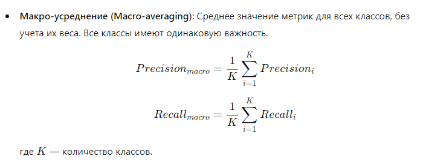

Где:
- **K** — количество классов.

### Взвешенное усреднение (Weighted-averaging)

**Среднее значение метрик для всех классов с учетом их частоты (или веса).**  
Чем больше класс, тем больше его вклад в итоговую метрику.

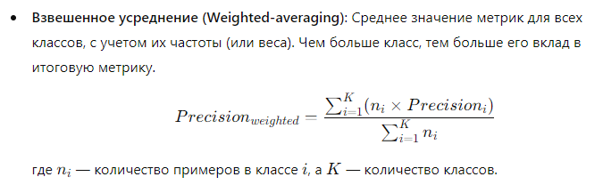

Где:
- **nᵢ** — количество примеров в классе *i*.
- **K** — количество классов.

--- 

# Как все это реализовать?

Для решения задачи мультиклассовой классификации с несбалансированными данными, где важно учитывать все ошибки, можно использовать:

- **scikit-learn** — для вычисления метрик.
- **numpy** — для работы с массивами данных.

## Установка библиотек

```bash
pip install scikit-learn numpy
```

## Пример кода

```python
import numpy as np
from sklearn.metrics import precision_score, recall_score, f1_score, classification_report
from sklearn.model_selection import train_test_split
from sklearn.ensemble import RandomForestClassifier
from sklearn.preprocessing import LabelEncoder
from sklearn.metrics import confusion_matrix

# Для примера создадим фейковые данные
# Пусть у нас есть 1000 изображений (вектора признаков)
# 3 класса: 'A', 'B', 'C'

# Генерация случайных данных (1000 образцов, 10 признаков)
np.random.seed(42)
X = np.random.rand(1000, 10)

# Классы: A, B, C (с некоторым несбалансированным распределением)
y = np.array(['A']*700 + ['B']*200 + ['C']*100)

# Разделим данные на обучающую и тестовую выборки
X_train, X_test, y_train, y_test = train_test_split(X, y, test_size=0.2, random_state=42)

# Преобразуем метки классов в числа
label_encoder = LabelEncoder()
y_train_encoded = label_encoder.fit_transform(y_train)
y_test_encoded = label_encoder.transform(y_test)

# Обучим классификатор (например, случайный лес)
clf = RandomForestClassifier(random_state=42)
clf.fit(X_train, y_train_encoded)

# Предсказания модели
y_pred = clf.predict(X_test)

# 1. Вычисление Precision, Recall и F1 с макро-усреднением:
precision_macro = precision_score(y_test_encoded, y_pred, average='macro')
recall_macro = recall_score(y_test_encoded, y_pred, average='macro')
f1_macro = f1_score(y_test_encoded, y_pred, average='macro')

print(f"Макро-усредненный Precision: {precision_macro:.4f}")
print(f"Макро-усредненный Recall: {recall_macro:.4f}")
print(f"Макро-усредненный F1: {f1_macro:.4f}")

# 2. Метод "Один против одного" (One-vs-One):
# Для этого мы используем 'average=None', чтобы вычислить метрики для каждой пары классов
precision_ovo = precision_score(y_test_encoded, y_pred, average=None)
recall_ovo = recall_score(y_test_encoded, y_pred, average=None)
f1_ovo = f1_score(y_test_encoded, y_pred, average=None)

print("\nМетрики Один против одного (One-vs-One) для каждого класса:")
print("Precision для каждого класса:", precision_ovo)
print("Recall для каждого класса:", recall_ovo)
print("F1 для каждого класса:", f1_ovo)

# 3. Дополнительно, можем вывести полный отчет по классификации (для всех классов)
print("\nПолный отчет по классификации:")
print(classification_report(y_test_encoded, y_pred, target_names=label_encoder.classes_))

# 4. Составим матрицу ошибок
conf_matrix = confusion_matrix(y_test_encoded, y_pred)
print("\nМатрица ошибок (Confusion Matrix):")
print(conf_matrix)
```
---

# Итог

В рамках работы над нашим проектом, исходя из того, что мы не сами собираем датасет и не можем гарантировать его сбалансированность, использование **F1-оценки** является самым оптимальным вариантом.  
В ином случае, мы не сможем оценить качество модели в полной мере.  

Поскольку у нас много классов, мы воспользуемся методом **"Один против всех"** для получения общей оценки модели.  
Кроме того, мы будем использовать библиотеку **scikit-learn** для применения готовых реализаций этих методов.

---

# Источники по метрикам

1. [Метрики Accuracy, Precision и Recall](https://pythonru.com/baza-znanij/metriki-accuracy-precision-i-recall)
2. [Habr: Метрики классификации](https://habr.com/ru/articles/661119/)
3. [F1-Score Glossary](https://www.ultralytics.com/ru/glossary/f1-score)
4. [Видеообзор на YouTube](https://www.youtube.com/watch?v=-jplpYLrcdM)


# Наивный байесовский алгоритм

- [Medium](https://medium.com/nuances-of-programming/%D0%BD%D0%B0%D0%B8%D0%B2%D0%BD%D1%8B%D0%B9-%D0%B1%D0%B0%D0%B9%D0%B5%D1%81%D0%BE%D0%B2%D1%81%D0%BA%D0%B8%D0%B9-%D0%B0%D0%BB%D0%B3%D0%BE%D1%80%D0%B8%D1%82%D0%BC-%D0%B2%D1%81%D1%91-%D1%87%D1%82%D0%BE-%D0%BD%D1%83%D0%B6%D0%BD%D0%BE-%D0%BE-%D0%BD%D1%91%D0%BC-%D0%B7%D0%BD%D0%B0%D1%82%D1%8C-85f6e04c3b74)

*Условная вероятность* — это вероятность наступления одного события при условии, что другое событие (по предположению, допущению, подтверждённому или неподтверждённому доказательством утверждению) уже произошло.

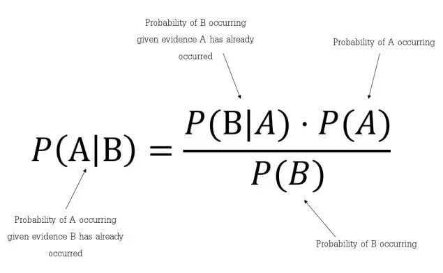

- как часто происходит событие B при наступлении события A, что обозначается в формуле как P(B|A);
- какова вероятность того, что A не зависит от других событий, обозначаемая в формуле как P(A);
- какова вероятность того, что B не зависит от других событий. В формуле она обозначается как P(B).

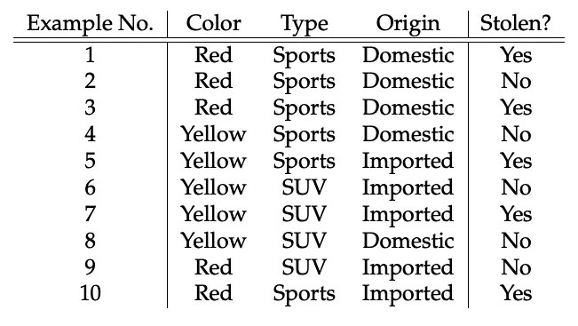

Теперь мы можем оценить характер делаемых в рамках наивного байесовского алгоритма допущений с использованием данных нашего примера:

- предположим, что среди этих параметров нет зависимых друг от друга. Например, красный цвет не имеет никакого отношения к типу или стране производства автомобиля. Отсюда первое допущение, что эти параметры являются *независимыми*;
- второе допущение: у каждого параметра одинаковое *влияние* (или *важность*). Например, зная только цвет и тип, нельзя предсказать результат. Ведь ни один из параметров не имеет большего или меньшего значения по сравнению с другими и все вносят равный вклад в результат.

## Проблема нулевой частоты
Одним из недостатков наивного байесовского алгоритма является то, что если класс и значение параметра не встречаются вместе, то оценка вероятности, высчитываемой с использованием частот, будет равна нулю. В итоге после перемножения всех вероятностей мы получим ноль.

В байесовской среде было найдено решение этой проблемы нулевой частоты: к каждой комбинации класса и значения параметра добавлять единичку, когда значение параметра нулевое. Появляется нулевое значение, поэтому при вычислении вероятностей добавляем единичку к каждому значению этой таблицы.

А что если в качестве характеристик будут числовые значения?

Одно из решений: перед тем как создавать частотные таблицы, нужно преобразовывать числовые значения в их категориальные аналоги. Другим решением, как было показано выше, может быть использование распределения числовой переменной с приблизительной оценкой частотности, близкой к истинной. Например, один из распространённых методов заключается в применении нормальных распределений или распределений Гаусса для числовых переменных.

Плотность распределения вероятностей для нормального распределения определяется двумя параметрами (среднее значение и среднеквадратическое отклонение) по формуле:

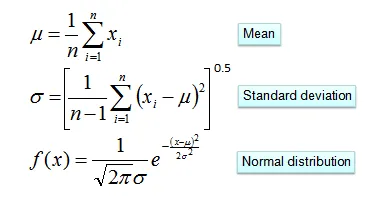

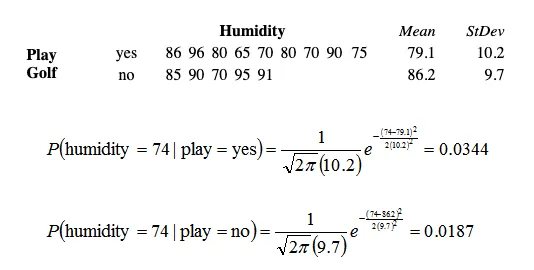

# Сверточные нейронные сети

- [Аспект](https://na-journal.ru/5-2023-informacionnye-tekhnologii/5244-raspoznavanie-rukopisnyh-cifr-pri-pomoshchi-svertochnyh-neironnyh-setei?ysclid=m5xldeiaz5973784433)

Свёрточная нейронная сеть (англ. convolutional neural network, CNN) — специальная архитектура искусственных нейронных сетей, предложенная Яном Лекуном в 1988 году и нацеленная на эффективное распознавание образов, входит в состав технологий глубокого обучения (англ. deep learning).

В качестве входных данных сверточная нейронная сеть в основном принимает цветные изображения в формате RGB. То есть нейросеть принимает на вход трехмерный тензор, где первые две размерности отвечают за положения пикселя, а третья за каналы цветности. В случае с рукописными цифрами на вход будет приходить черно-белое изображение, а значит, канал цветности будет только один.

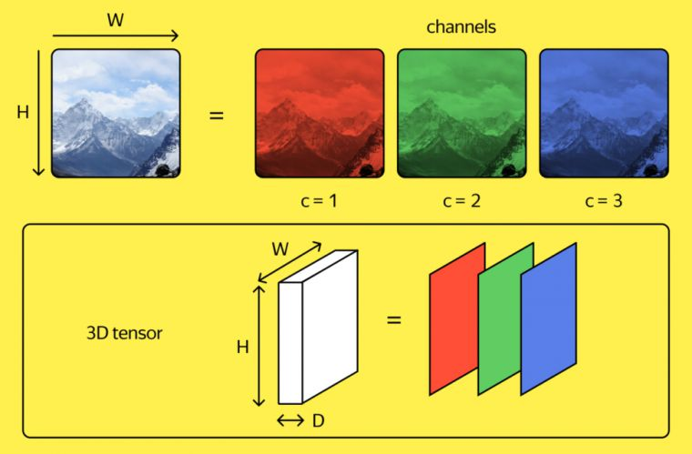

В сверточных нейронных сетях, используемых для обработки изображений, информация проходит через несколько слоев обработки. Каждый слой выполняет определенную функцию по обработке сигнала и извлечению признаков изображения. Определение различных типов слоев, доступных в сверточной нейронной сети, является важным аспектом, чтобы понимать, как работает этот тип нейронных сетей.

Слой свертки является одним из основных слоев в сверточных нейронных сетях (CNN). Он используется для нахождения локальных шаблонов во входных данных, таких как изображения.

Сверточный слой представляет из себя набор карт (другое название – карты признаков, в обиходе это обычные матрицы), у каждой карты есть синаптическое ядро (в разных источниках его называют по-разному: сканирующее ядро или фильтр).

Слой свертки принимает на вход трехмерный тензор (например, изображение) и применяет к нему фильтр (ядро свертки), который проходит по всему изображению и выполняет операцию свертки. В результате получается новый тензор со сниженными размерами.

Основная идея слоя свертки заключается в нахождении признаков на изображении, таких как границы, углы и другие характеристики. Каждый фильтр в слое свертки выполняет свертку с изображением и находит зону, где признак наиболее сильный.

Следующий слой, в который попадают данные при использовании сверточной нейронной сети это слой пуллинга. Пулинговый слой призван снижать размерность изображения. Исходное изображение делится на блоки размером w×h и для каждого блока вычисляется некоторая функция. Чаще всего используется функция максимума (англ. max pooling) или (взвешенного) среднего.

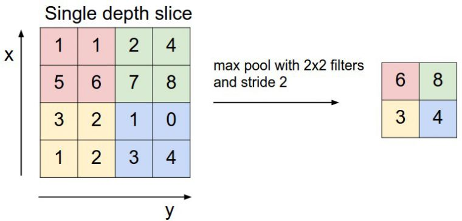

# YOLO

- [Хабр](https://habr.com/ru/companies/otus/articles/827468/)
- [Medium](https://medium.com/@tejasdalvi927/object-detection-with-yolo-and-opencv-a-practical-guide-cf7773481d11)

Обнаружение объектов является достаточно популярной задачей компьютерного зрения, которая включает в себя идентификацию и обнаружение объектов на изображениях или видео. Данная задача является частью многих приложений, например, таких как беспилотные автомобили, робототехника, видеонаблюдение и т. д. За прошедшие годы разработано множество алгоритмов и методов для поиска объектов на изображениях и их положениях. Наилучшее качество выполнения таких задач достигается при использовании сверточных нейронных сетей.

Одной из самых популярных архитектур нейронных сетей для таких задач, является YOLO (you only look once), созданная в 2015 году. С тех пор появилось довольно много версий данных алгоритмов. Последние выпуски сети предназначены для таких задач как распознавание, обнаружение и сегментация изображений. 

Мы будем рассматривать архитектуру YOLO только для задачи обнаружения объектов на изображении. В данном случае цель алгоритма — предсказать класс объекта и нарисовать ограничивающую рамку, которая определяет местоположение объекта на входном изображении.

Один из способов задач детекции состоит в разбиении изображения на квадратные области, а затем классификация этих областей на наличие объекта и классификацию самого объекта. Таким образом изображение просматривается дважды, один раз для определения областей где есть объект, а второй — для классификации этого объекта. YOLO использует другой подход. Исходное изображение сжимается таким образом, чтобы получить квадратную матрицу, в каждой клетке которого записана информация о наличии объекта и классе этого объекта на соответствующей части картинки. Для каждой ячейки выводится вероятности определяемого класса. Ячейки, имеющие вероятность класса выше порогового значения, выбираются и используются для определения местоположения объекта на изображении. То есть YOLO просматривает картинку один раз, что существенно увеличивает скорость обработки. Отличается высокой скоростью и точностью обнаружения объектов. На выходе работы такой сети мы хотим получить примерно такое изображение:

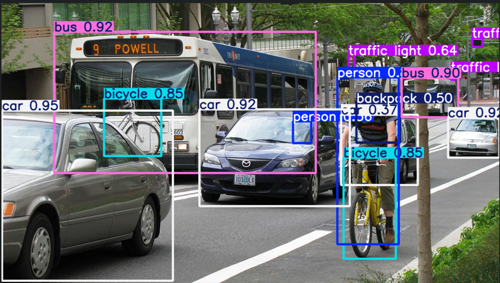

---
# Обработка данных

Так как ни один метод машинного обучения не принимает в качестве признака для наблюдения фотографии в исходном виде, нам нужно преобразовать наши фотографии в более подходящий вид. Например, мы можем представить фотографию в виде матрицы цветов. Однако перед этим мы наложим на фотографии из датасета серый фильтр, чтобы уменьшить число цветовых каналов. Перевод необходим по следующим причинам:

1. Конвертация изображения в черно-белое (грейскейл) уменьшает размерность до одного канала, что упрощает вычисления.
2. Меньший объем данных снижает требования к памяти и ускоряет обучение модели.

В целом, в нашем датасете при первичном анализе наблюдений с цветными вариациями не было обнаружено. Однако, так как мы не можем перебрать каждое фото, и чтобы гарантировать это, мы всё-таки воспользовались методом `cvtColor` из библиотеки `cv2`. Также исходную матрицу мы преобразуем путём векторизации в вектор. Таким образом, у нас получится, что каждый элемент вектора – это признак нашего наблюдения, который уже можно будет передать методам машинного обучения для обучения.

## Общая формула векторизации

Для матрицы \( A \) размером \( m x n \), где элемент \( a_{ij} \) находится на \( i \)-й строке и \( j \)-м столбце, \( vec(A) \) можно записать как:

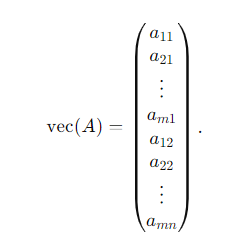

Если элемент \( a_{ij} \) соответствует порядковому номеру в \( vec(A) \), его индекс можно выразить через формулу:


индекс в векторе = (j - 1) * m + i

В коде обработкой фотографии занимается метод `load_and_preprocess_image`:

```python
def load_and_preprocess_image(image_path):    
    image = cv2.imread(image_path)
    
    gray_image = cv2.cvtColor(image, cv2.COLOR_BGR2GRAY)
    
    return gray_image.flatten()
```

Для получения массивов обработанных фотографий и их меток был написан метод `get_dataset`. 
В нем основные сложности были связаны с тем, что датасет разбит на разные подпапки, и нам нужно было корректно пройтись по всем ним:

```python
def get_dataset():
    X, Y = [], []
        
    for dir_name in get_dataset_directories():
        dir = os.listdir(DATASET_PATH + f"/{dir_name}")
        
        for file in dir:
            path = os.path.join(DATASET_PATH, dir_name, file)
            X.append(load_and_preprocess_image(str(path)))
            Y.append(dir_name)
    
    return X, Y
```

После такой обработки всех картинок в нашем датасете, мы решили, используя библиотеку `pandas`, сохранить обработанный датасет в виде CSV файла:

```python
X, y = get_dataset()

pixel_columns = [f"pixel_{i+1}" for i in range(len(X[0]))]
df_pixels = pd.DataFrame(X, columns=pixel_columns)

df_pixels['label'] = y

df_pixels.to_csv('dataset.csv', index=False)

df_pixels.head()
```

**ТУТ БУДЕТ ТЕКСТ ПО PCA, но пока SVC еще не получил итог по своим метрикам.**

Теперь, когда наш обработанный датасет записан в отдельный CSV файл, нам станет проще подгружать его, ведь теперь нам не нужно каждый раз запускать обработку такого количества фотографий:

```python
df = pd.read_csv('dataset.csv')

X = df.drop(columns=['label']).to_numpy()
y = df['label'].to_numpy().astype(str)

X
```

Также, так как не все модели работают хорошо со строковыми таргетами, мы написали код, который проводит one-hot encoding для наших меток:

```python
encoder = OneHotEncoder(sparse_output=False)

y_encoded = encoder.fit_transform(y.reshape(-1, 1))

print("Исходные символы:")
print(y)
print("\nOne-hot encoded символы:")
print(y_encoded)

df_encoded = pd.DataFrame(y_encoded, columns=encoder.get_feature_names_out())
df_encoded['Symbol'] = y

print("\nDataFrame с символами и их one-hot кодами:")
print(df_encoded)
print(y_encoded)
```
# Источники по обработке данных:

- [Vectorization (mathematics)](https://en.wikipedia.org/wiki/Vectorization_(mathematics)) – векторизация  
- [Документация OpenCV](https://docs.opencv.org/4.x/)  
- [Документация Pandas](https://pandas.pydata.org/docs/)  
- [Документация NumPy](https://numpy.org/doc/)   
- [One-hot encoding (Habr)](https://habr.com/ru/articles/666234/)  


---

# Обучение. Наивный-Баейс.

Загрузив обработанный датасет, мы приступили к его изучению. Нам было важно узнать, как обстоят дела с распределением в датасете и есть ли там пустые таргеты (и избавиться от таких наблюдений в таком случае):

```python
label_counts = df['label'].value_counts()

print("Распределение меток:")
print(label_counts)

label_counts.plot(kind='bar', alpha=0.7, color='skyblue')
plt.title("Распределение математических символов")
plt.xlabel("Математический символ")
plt.ylabel("Количество изображений")
plt.xticks(rotation=45)
plt.show()
print("Распределение меток:")
print(label_counts.to_dict())

print("Пустых меток:")
print(df['label'].isnull().sum())
```

В итоге распределение, которое мы увидели, было далеко не равномерным:

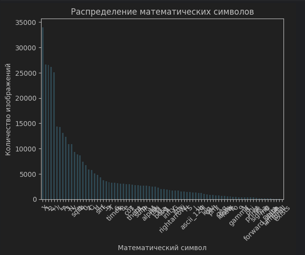

Такое распределение точно не подходит для обучения методом Наивного Байеса, поэтому для компенсации несбалансированного распределения мы решили воспользоваться методом весов. Для каждого класса мы хотели задать вес таким образом, чтобы он по важности был сравним с теми классами, которые хорошо представлены в датасете:

```python
classes = np.unique(y)

class_weights = compute_class_weight('balanced', classes=classes, y=y)
class_weights_dict = dict(zip(classes, class_weights))

class_weights_dict
```

Однако, как мы узнали уже потом, есть много моделей, которые принимают такие веса как параметр, но только не Наивный Байес. У него в формуле используются только априорные вероятности, которые и так автоматически рассчитываются при передаче признаков и меток. 

Мы попытались, в целях эксперимента, передать ему рассчитанные нами априорные веса, попробовав привязать их к весам классов:

```python
class_prior = np.array([class_weights_dict[cls] for cls in classes])

class_prior = class_prior / np.sum(class_prior)

print(class_prior)
```

После этого мы разбили наш датасет на обучающую и тестовую выборки в соотношении 80 на 20, используя параметр `stratify`, который гарантирует, что распределение классов в тренировочной и тестовой выборках будет пропорционально их распределению в исходных данных:

```python
X_train, X_test, y_train, y_test = train_test_split(X, y, test_size=0.2, random_state=42, stratify=y)
```

Осталось только провести макро-расчет оценок:

```python
y_pred = model.predict(X_test)

precision_macro = precision_score(y_test, y_pred, average='macro')
recall_macro = recall_score(y_test, y_pred, average='macro')
f1_macro = f1_score(y_test, y_pred, average='macro')

print(f"Макро-усредненный Precision: {precision_macro:.4f}")
print(f"Макро-усредненный Recall: {recall_macro:.4f}")
print(f"Макро-усредненный F1: {f1_macro:.4f}")
```

В итоге, результат обучения модели с нашими априорными весами показал такой результат:

- Макро-усредненный Precision: 0.3862  
- Макро-усредненный Recall: 0.5329  
- Макро-усредненный F1: 0.3983  

Результат без весов показал такой результат:

- Макро-усредненный Precision: 0.3804  
- Макро-усредненный Recall: 0.5368  
- Макро-усредненный F1: 0.3956  

Это неудивительный результат в случае этого метода для такого несбалансированного распределения классов в датасете. К сожалению, наши попытки исправить положение самостоятельным расчетом априорных весов лишь уменьшили качество нашей модели.

Для того чтобы сохранить то, что получилось, мы воспользовались библиотекой `joblib`:

```python
joblib.dump(model, 'svc_model.pkl')

print("Модель сохранена в файл 'svc_model.pkl'")
```

# Источники по обучению Наивный-Байес:

- [Multinomial Naïve Bayes (docs)](https://scikit-learn.org/stable/modules/generated/sklearn.naive_bayes.MultinomialNB.html#sklearn.naive_bayes.MultinomialNB)  
- [Compute Class Weight (docs)](https://scikit-learn.org/stable/modules/generated/sklearn.utils.class_weight.compute_class_weight.html)  
- [Train Test Split (docs)](https://scikit-learn.org/stable/modules/generated/sklearn.model_selection.train_test_split.html)